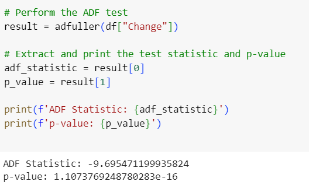
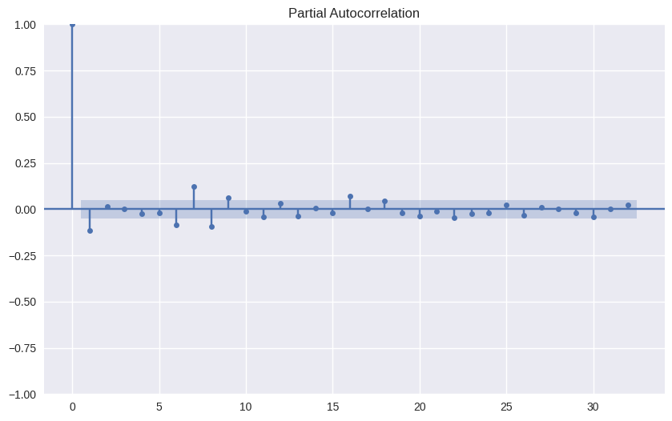
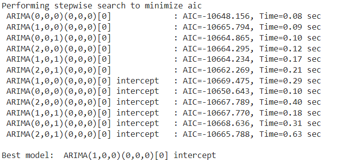
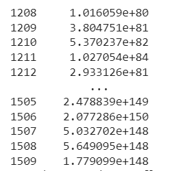
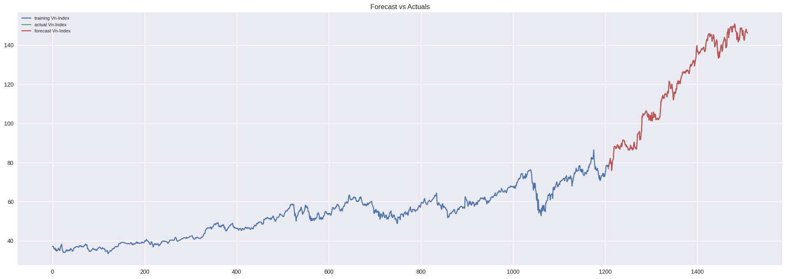

# Áp dụng mô hình Arima trong dự báo giá chứng khoán
## Tổng quan dữ liệu
 Để mô phỏng cho mô hình này, ta sử dụng bộ dữ liệu giá đóng cửa theo ngày của cổ phiếu Google (GOOG). Dữ liệu được tải từ trang Yahoo Finance, với tổng số 1510 quan sát (từ 04/01/2016 đến 30/12/2021).
 
## Xây dựng mô hình ARIMA(p,d,q)
 Tiếp đến, ta xét tính dừng của chuỗi.
 
 Có thể thấy chuỗi giá cổ phiếu là không dừng.
 Ta làm dừng chuỗi với giá trị d=1
 Khi đó, ta có biểu đồ acf và pacf cho chuỗi sai phân bậc 1 như sau:
 
 
 Để tìm ra mô hình dự báo phù hợp nhất, ta dùng phương pháp thực nghiệm bằng cách so sánh các chỉ số AIC. Kết quả so sánh cho thấy mô hình ARIMA(1, 0, 0) có chỉ số AIC bé nhất và là mô hình phù hợp nhất đối với bộ dữ liệu đã cho.
 
## Kết quả dự báo
Chia tập dữ liệu thành 2 phần: Tập train(80%) và tập test(20%). Dùng model đã huấn luyện ở tập train để áp dụng vào tập test ta có kết quả như sau:

Dưới đây là hình ảnh mô phỏng giá trị thực tế và giá trị dự đoán:

## Kết luận
Có thể thấy mô hình khá phù hợp với bộ dự liệu đã cho.

