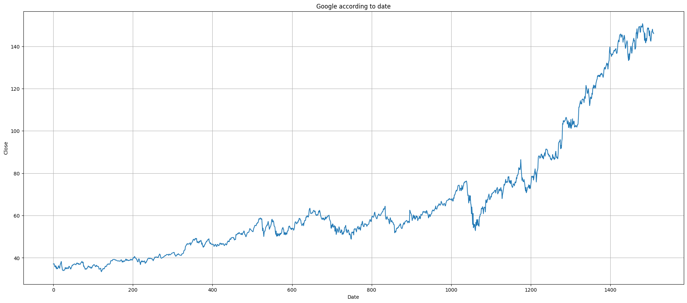

# Áp dụng mô hình Arima trong dự báo giá chứng khoán
 Để mô phỏng cho mô hình này, ta sử dụng bộ dữ liệu giá đóng cửa theo ngày của cổ phiếu Google (GOOG). Dữ liệu được tải từ trang Yahoo Finance, với tổng số 1510 quan sát (từ 04/01/2016 đến 30/12/2021).
 
## 

### 

